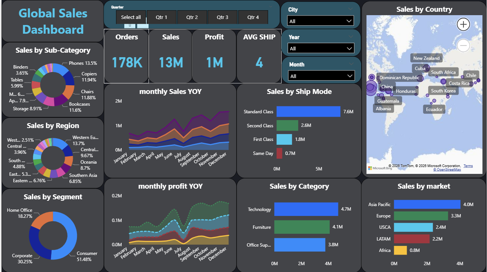
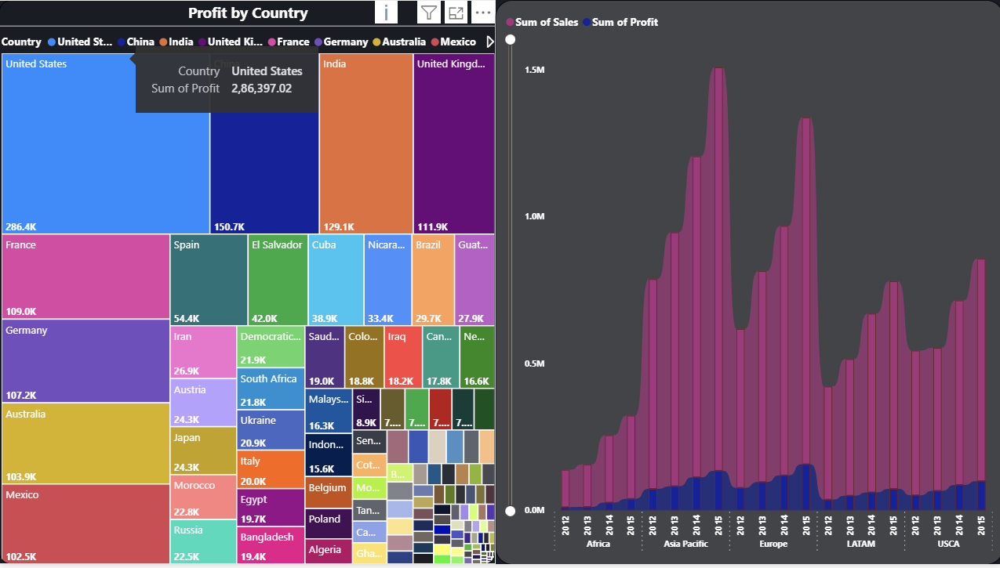
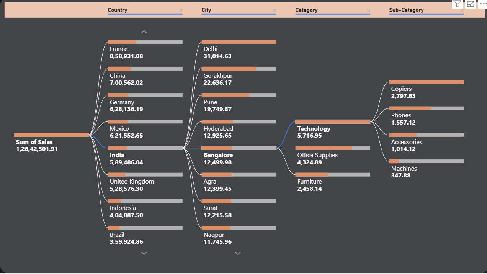
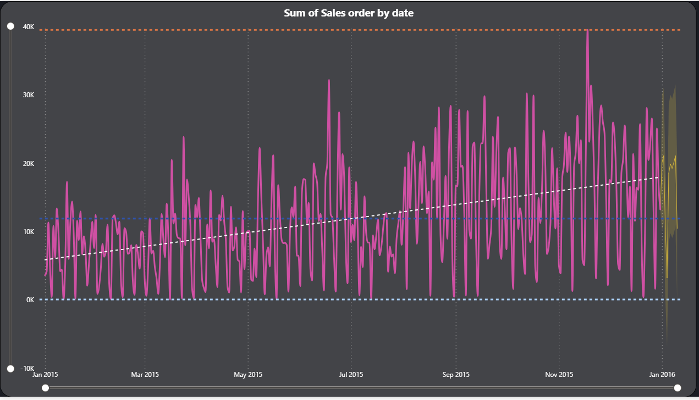

# 🌍 Global Super Store Sales Analytics Dashboard

**Interactive Power BI dashboard that transforms 4 years of retail data into actionable business insights for strategic decision-making.**

---

## 📊 Project Overview

A comprehensive business intelligence solution that analyzes global retail operations across **multiple countries, product categories, and time periods** to identify growth opportunities, optimize inventory, and forecast future sales trends.

**Business Impact:**
- Tracks $13M+ in sales across 178K orders
- Monitors performance across 50+ countries and 4 regions
- Provides real-time insights into profitability and shipping efficiency
- Enables data-driven decisions for inventory and regional strategies

---

## 🎯 Key Features

### 1️⃣ Sales Performance Analytics
- **Revenue Tracking**: $13M total sales with $1M profit analysis
- **Geographic Analysis**: Country and city-level performance breakdown
- **Trend Analysis**: Year-over-year (YoY) monthly sales and profit trends
- **Market Segmentation**: Corporate vs Consumer segment comparison

### 2️⃣ Product Intelligence
- **Category Performance**: Technology, Furniture, Office Supplies comparison
- **Sub-Category Insights**: Identifies top performers (Copiers, Phones, Accessories)
- **Sales Distribution**: Donut charts showing product mix and regional splits

### 3️⃣ Time-Series Forecasting
- **Sales Prediction Model**: 15-day sales forecast with trend analysis
- **Seasonal Pattern Detection**: Identifies peak and low-demand periods
- **Growth Trajectory**: White dashed trend line shows business growth over time

### 4️⃣ Operational Insights
- **Shipping Analysis**: 4-day average shipping time across modes
- **Order Volume Metrics**: 178K orders processed
- **Regional Performance**: Asia Pacific leads with $4M in sales

---

## 🛠️ Technical Implementation

**Tools & Technologies:**
- **Power BI Desktop** – Dashboard development and visualization
- **DAX (Data Analysis Expressions)** – Custom metrics and KPIs
- **Power Query** – Data transformation and cleaning
- **Time Intelligence Functions** – YoY calculations and forecasting

**Data Pipeline:**
1. **Data Import** – Loaded 4-year historical sales dataset
2. **Data Cleaning** – Standardized dates, removed duplicates, handled nulls
3. **Data Modeling** – Created relationships between Orders, Products, Customers
4. **DAX Measures** – Built calculated columns for profit margins, growth rates
5. **Visualization** – Designed interactive dashboard with drill-down capabilities
6. **Forecasting** – Applied time-series analysis for sales predictions

---

## 📈 Key Insights Delivered

✅ **Top Revenue Markets**: United States ($2.9M), India ($129K), China ($151K)  
✅ **Most Profitable Category**: Technology generates $5.7K in sales  
✅ **Best Sub-Category**: Copiers contribute $2.8K revenue  
✅ **Peak Sales Period**: Q4 shows highest order volumes  
✅ **Shipping Efficiency**: Standard Class dominates with 7.6M shipments  
✅ **Growth Trend**: Consistent upward trajectory from 2015-2016  

---

## 🎨 Dashboard Capabilities

**Interactive Filters:**
- Quarter selection (Q1-Q4)
- City-level drill-down
- Year and month filtering
- Dynamic cross-filtering across all visuals

**Visualizations Used:**
- 📊 Stacked area charts (monthly trends)
- 🗺️ Geographic map (country-wise sales)
- 🍩 Donut charts (segment distribution)
- 📈 Line charts with forecasting
- 🎯 KPI cards (key metrics)
- 🌳 Hierarchical decomposition tree

---

## 🚀 Business Use Cases

1. **Executive Reporting** – Real-time sales performance monitoring
2. **Inventory Planning** – Identify slow-moving vs fast-moving products
3. **Regional Strategy** – Allocate resources to high-performing markets
4. **Demand Forecasting** – Plan stock levels based on predicted sales
5. **Profitability Analysis** – Compare profit margins across categories

---

## 💡 Skills Demonstrated

`Power BI` `DAX` `Data Modeling` `Business Intelligence` `Sales Analytics` `Forecasting` `Data Visualization` `ETL` `KPI Development` `Executive Dashboards`

---

## 🎓 Key Learnings

- Advanced DAX calculations for YoY growth and profit margins
- Time intelligence functions for trend analysis
- Geographic data visualization best practices
- Forecasting techniques using Power BI's analytics features
- Dashboard design principles for executive-level reporting

---

## 📌 Assumptions

- **Shipped Date = Delivery Date** for shipping time calculations
- Data represents retail operations from 2015-2016
- All currency values in USD

---

## 📫 Contact

**Interested in discussing this project or collaboration opportunities?**

⭐ **Star this repository** if you find it useful for learning Power BI!

---

*Built with Power BI | Designed for Business Impact*
